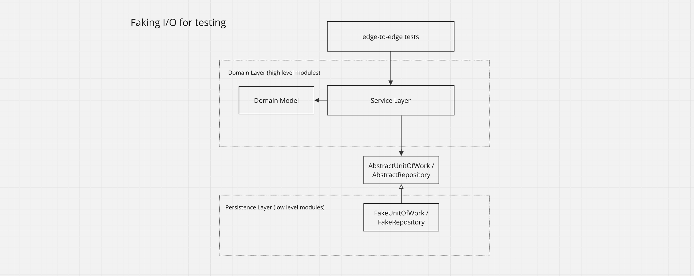

# Allocation Service

[![TypeScript version][ts-badge]][typescript-5-4] [![Node.js version][nodejs-badge]][nodejs] [![Build Status - GitHub Actions][gha-badge]][gha-ci]

Backend API for allocating customer orders to batches of stock in a warehouse.

### Stack
- Node.js
- TypeScript
- PostgreSQL
- Express.js
- Prisma ORM
- Jest
- Docker
- Github Actions

---

### Architecture

The application uses the [dependency inversion principle](https://en.wikipedia.org/wiki/Dependency_inversion_principle), and creates abstractions around I/O and injects them. This allows us to pass a fake I/O to the service layer for testing the application "edge-to-edge" with fast, in-memory unit tests.



---

For real-world and E2E testing, the service layer is passed real I/O that talks to a database. Because we have already exhaustively tested the service layer with fast, in-memory tests, less slow E2E tests are needed. We can achieve a healthy testing pyramid with high coverage.


---

A few patterns are used to aid dependency inversion.

**Repository** - an abstraction around data access. Handles syncing between the domain model and the ORM.<br>
**Unit of Work** - an abstraction around transactions and atomicity.<br>
**Service Layer** - the entrypoint for injecting I/O and defines the application's use cases.<br>
**Domain Model** - an object module of the business domain free of dependencies on data access.<br>
**Data Mapper** - handles conversion between domain objects and db objects.<br>

**Trade-offs** - Each pattern adds indirection and congintive load and wouldn't be necessary in a simple application. You could, for example, still achieve dependency inversion and abstracting I/O with only a simple repository and a service layer.

### Todo
- Add consistency boundary with optimistic concurrency
-- invariant: a batch's available quantity must be greater than or equal to zero

### Setup
Install docker and then run

```sh
git clone git@github.com:msolorio/allocation-service.git
cd allocation-service
make build
make up
make migrate
make test
```

### Make Scripts

- `make build` - Build docker container
- `make up` - Start app and TypeScript
- `make down` - Remove containers
- `make logs` - Show container logs
- `make test` - Run tests
- `make migrate` - Run db migrations
- `make run <command>` - Run a command in the container

[ts-badge]: https://img.shields.io/badge/TypeScript-5.4-blue.svg
[typescript-5-4]: https://devblogs.microsoft.com/typescript/announcing-typescript-5-4/
[nodejs-badge]: https://img.shields.io/badge/Node.js-=%2020.16.0-blue.svg
[nodejs]: https://nodejs.org/dist/v20.16/docs/api/
[gha-badge]: https://github.com/jsynowiec/node-typescript-boilerplate/actions/workflows/nodejs.yml/badge.svg
[gha-ci]: https://github.com/jsynowiec/node-typescript-boilerplate/actions/workflows/nodejs.yml
